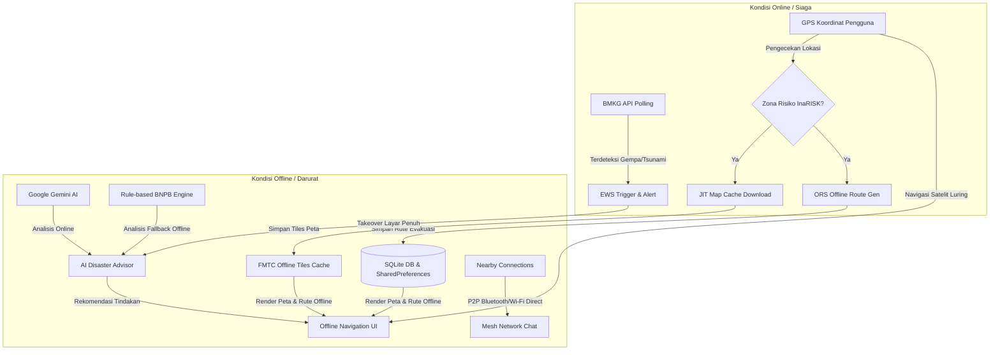

<div align="center">
  

  # 🚨 SUAR
  ### *Tetap Menyala Saat Segalanya Padam*

  **Aplikasi Mitigasi Bencana *Offline-First* dengan Integrasi AI Triage, Rute Evakuasi Cerdas, Pemantauan Latar Belakang, dan Komunikasi P2P Mesh Network.**

  [](https://flutter.dev)
  [](https://dart.dev)
  [](https://riverpod.dev)
  [](https://deepmind.google/technologies/gemini/)
  [](https://www.android.com)

  ---

  ### 📥 [Unduh Aplikasi (APK) - Rilis Terbaru](https://drive.google.com/drive/folders/1NNJlm1PrmNcebeoa7-MFdydZu_QjBkW9?usp=sharing)
  *(Klik tautan di atas untuk mengunduh versi rilis Android stabil dari SUAR)*

</div>

---

## 📖 Daftar Isi
1. [Tentang SUAR](#-tentang-suar)
2. [Fitur Utama](#-fitur-utama)
3. [Arsitektur Sistem & Alur Data](#-arsitektur-sistem--alur-data)
4. [Teknologi yang Digunakan (Tech Stack)](#-teknologi-yang-digunakan-tech-stack)
5. [Struktur Direktori Proyek](#-struktur-diretori-proyek)
6. [Panduan Memulai (Getting Started)](#-panduan-memulai-getting-started)
   - [Prasyarat](#prasyarat)
   - [Instalasi](#instalasi)
   - [Konfigurasi Environment Variables](#konfigurasi-environment-variables)
   - [Menjalankan Aplikasi](#menjalankan-aplikasi)
7. [Panel Developer & Simulasi Pengujian](#-panel-developer--simulasi-pengujian)
8. [Tim & Kontributor](#-tim--kontributor)

---

## 📖 Tentang SUAR

**SUAR** dirancang untuk menjembatani titik kritis antara terjadinya bencana alam (terutama gempa bumi & tsunami) dengan tindakan penyelamatan diri. Ketika bencana skala besar melanda, infrastruktur telekomunikasi seluler dan internet sering kali lumpuh total, memicu disorientasi massal dan memutus jalur komunikasi penyelamatan. 

SUAR hadir sebagai solusi tangguh berbasis **Offline-First**. Dengan menggabungkan data BMKG secara real-time, analisis spasial peta risiko InaRISK BNPB, dan pemrosesan AI, SUAR mengunduh peta serta rute evakuasi secara otomatis sebelum sinyal hilang. Ketika internet mati sepenuhnya, navigasi luring dan fitur komunikasi berbasis jaringan peer-to-peer (Mesh Network) tetap dapat digunakan untuk menghubungkan korban di daerah terdampak.

Aplikasi ini dikembangkan untuk ajang **IDCamp Dicoding Challenge 2026** di bawah tema *"Small Apps for Big Preparedness"*. Seluruh kebutuhan pengembangan telah didokumentasikan pada berkas [SUAR_PRD.md](./SUAR_PRD.md).

---

## ✨ Fitur Utama

### 🧠 1. AI Triage EWS (Early Warning System)
* **BMKG Integration:** Secara berkala memantau data gempa bumi langsung dari API BMKG saat terhubung ke internet.
* **InaRISK Spatial Analysis:** Menganalisis radius bahaya tsunami dan zona risiko BNPB berdasarkan titik GPS koordinat pengguna.
* **Google Gemini AI Flash:** Menghasilkan keputusan *Triage* darurat secara cerdas (keputusan untuk Evakuasi vs. Berlindung di Tempat) beserta instruksi keselamatan yang dipersonalisasi sesuai profil geografis pengguna.
* **Offline Advisor Fallback:** Apabila koneksi internet terputus sebelum analisis AI selesai, aplikasi mengaktifkan algoritma penilai risiko berbasis aturan BNPB lokal.

### 🗺️ 2. Smart Offline Evacuation (Hybrid Snapping)
* **Just-In-Time (JIT) Geofence Caching:** Otomatis mengunduh peta (*map tiles*) radius 3-5 KM di latar belakang saat pengguna terdeteksi memasuki Zona Merah InaRISK.
* **Hybrid Routing & Elevation Snapping:** Menentukan dataran tinggi aman terdekat (>5 meter) menggunakan algoritma 8-arah mata angin, memverifikasi rute evakuasi pejalan kaki (`foot-walking`) dengan API OpenRouteService (ORS), dan menyimpan data polyline rute secara lokal.
* **Offline Fallback Navigation:** Menampilkan visualisasi peta yang di-cache, posisi GPS real-time (via satelit), dan rute evakuasi secara visual tanpa memerlukan internet sama sekali.

### 🔔 3. Pemantauan Latar Belakang (Background Monitoring)
* **Background Polling:** Menggunakan `Workmanager` dan isolasi latar belakang Dart untuk terus mengamati aktivitas seismik BMKG meskipun aplikasi sedang ditutup.
* **Foreground Service Safety Net:** Mencegah sistem operasi Android melakukan penghentian paksa (*kill app*) dengan mendaftarkan layanan mitigasi di status bar.
* **Interactive Local Notifications:** Mengirimkan notifikasi darurat suara/getar keras secara instan ketika ada peringatan dini yang relevan di sekitar pengguna.

### 📡 4. Jaringan Obrolan Mesh P2P (Offline Mesh Chat)
* **Auto-Discovery:** Memindai dan menghubungkan perangkat terdekat yang menginstal SUAR secara otomatis menggunakan protokol Bluetooth & Wi-Fi Direct (melalui `nearby_connections`).
* **Multi-Hop Relay:** Pesan chat dikirimkan melalui jalur estafet dari satu perangkat ke perangkat lain (hingga 5 hop/lompatan) untuk menjangkau area di luar jangkauan sinyal Bluetooth langsung.
* **Public & Private Channels:** Menyediakan channel publik untuk siaran darurat massal dan chat privat 1-on-1 untuk melacak keberadaan rekan atau anggota keluarga.

---

## 📐 Arsitektur Sistem & Alur Data

SUAR dirancang menggunakan pola **Clean Architecture** dengan pendekatan berbasis fitur (*Feature-First*). Berikut adalah gambaran alur kerja sistem saat mendeteksi bencana hingga mengaktifkan mode penyelamatan luring:



---

## 🏗️ Teknologi yang Digunakan (Tech Stack)

Konfigurasi dependensi lengkap dikelola di [pubspec.yaml](./frontend/pubspec.yaml).

* **Framework:** Flutter (SDK ^3.10.4 atau lebih baru)
* **Bahasa Pemrograman:** Dart (SDK ^3.0.0)
* **Manajemen State & Routing:**
  - `flutter_riverpod` (v3.x) - Manajemen state reaktif dan terisolasi
  - `go_router` (v17.x) - Sistem navigasi deklaratif berbasis URL
* **Peta Luring & Data Geospasial:**
  - `flutter_map` - Rendering visualisasi peta interaktif
  - `flutter_map_tile_caching` (FMTC) - Penyimpanan caching luring peta berbasis SQLite/ObjectBox
  - `latlong2` & `geolocator` - Kalkulasi posisi geografis dan navigasi GPS luring
* **Komunikasi P2P & Latar Belakang:**
  - `nearby_connections` - Engine P2P (Bluetooth & Wi-Fi Direct) untuk Mesh Chat luring
  - `workmanager` & `flutter_local_notifications` - Pengecekan data darurat dan notifikasi berkala di latar belakang
* **Integrasi AI & Jaringan:**
  - `google_generative_ai` - Integrasi Google Gemini 1.5 Flash untuk analisis darurat
  - `dio` - HTTP Client untuk pemanggilan API BMKG dan OpenRouteService

---

## 📂 Struktur Direktori Proyek

Aplikasi ini dikembangkan dengan pendekatan monorepo. Berikut adalah pembagian struktur direktorinya:

* **[frontend/](./frontend)** — Seluruh kode Flutter dan konfigurasinya:
  * **[lib/](./frontend/lib)** — Kode sumber aplikasi Flutter:
    * **[core/](./frontend/lib/core)**
      * [router/](./frontend/lib/core/router) - Konfigurasi deklaratif GoRouter (Navigasi): [app_router.dart](./frontend/lib/core/router/app_router.dart)
      * [services/](./frontend/lib/core/services) - Layanan global background task: [background_service.dart](./frontend/lib/core/services/background_service.dart) & [notification_service.dart](./frontend/lib/core/services/notification_service.dart)
      * [theme/](./frontend/lib/core/theme) - Desain sistem, warna aksesibilitas tinggi, & tema aplikasi: [app_theme.dart](./frontend/lib/core/theme/app_theme.dart) & [app_colors.dart](./frontend/lib/core/theme/app_colors.dart)
    * **[features/](./frontend/lib/features)**
      * [ews_ai/](./frontend/lib/features/ews_ai) - Fitur deteksi gempa BMKG, koordinat InaRISK, dan Google Gemini AI
      * [map_evacuation/](./frontend/lib/features/map_evacuation) - Fitur peta luring, navigasi GPS, cache tiles, & ORS routing
      * [offline_mesh_chat/](./frontend/lib/features/offline_mesh_chat) - Komunikasi P2P Mesh luring (Bluetooth & Wi-Fi Direct)
      * [onboarding/](./frontend/lib/features/onboarding) - Perizinan kritis (GPS, Bluetooth, Battery Optimization)
      * [resources/](./frontend/lib/features/resources) - Panduan tanggap bencana offline
      * [user/](./frontend/lib/features/user) - Profil pengguna & panel simulator pengujian
    * **[shared/](./frontend/lib/shared)** - Komponen widget reusable global
    * [main.dart](./frontend/lib/main.dart) - Entry point utama inisialisasi aplikasi SUAR
* **[backend/](./backend)** — Seluruh kode backend NestJS & PostgreSQL + PostGIS:
  * **[src/](./backend/src)** — Kode sumber backend:
    * **[alerts/](./backend/src/alerts)** - Modul EWS polling BMKG, de-duplikasi hash gempa, filter threshold, dan kueri spasial.
    * **[users/](./backend/src/users)** - Modul pendaftaran perangkat FCM dan pembaruan koordinat `lastLocation` spasial.
  * **[test/](./backend/test)** — Automated E2E & unit spec tests.
  * [Dockerfile](./backend/Dockerfile) — Konfigurasi Docker container untuk Hugging Face Spaces.
  * [README.md](./backend/README.md) — Konfigurasi metadata Hugging Face Spaces.

---

## 🚀 Panduan Memulai (Getting Started)

### Prasyarat
Sebelum menjalankan aplikasi ini, pastikan Anda telah menyiapkan lingkungan berikut:
* **Flutter SDK** version `^3.10.4` ke atas.
* **Node.js** version `^18.0.0` atau `^20.0.0` (untuk backend).
* **Docker** & **Docker Compose** (untuk database PostGIS lokal).
* Akun **Google AI Studio** (untuk API Key Gemini).
* Akun **OpenRouteService** (untuk API Key ORS).

### Instalasi & Menjalankan Frontend (Aplikasi Flutter)

1. **Kloning Repositori**
   ```bash
   git clone https://github.com/devabrahmasta/suar_app.git
   cd suar_app/frontend
   ```

2. **Dapatkan Dependensi Paket**
   ```bash
   flutter pub get
   ```

3. **Konfigurasi Environment Variables (.env)**
   Buat berkas [.env](./frontend/.env) baru di direktori `frontend/` (sejajar dengan `pubspec.yaml`), lalu masukkan API key Anda:
   ```env
   GEMINI_API_KEY=masukkan_api_key_google_gemini_anda_di_sini
   ORS_API_KEY=masukkan_api_key_open_route_service_anda_di_sini
   ```

4. **Kompilasi dan Jalankan**
   Hubungkan perangkat Android asli (*real device*) via kabel data (diperlukan untuk pengujian sensor GPS, Bluetooth, dan tugas latar belakang secara akurat):
   ```bash
   flutter run
   ```

### Instalasi & Menjalankan Backend (NestJS + PostGIS)

1. **Pindah ke Direktori Backend**
   ```bash
   cd suar_app/backend
   ```

2. **Instal Dependensi NPM**
   ```bash
   npm install
   ```

3. **Jalankan Database PostgreSQL + PostGIS (Docker)**
   Pastikan Docker daemon Anda aktif, lalu jalankan container database:
   ```bash
   docker compose up -d
   ```

4. **Konfigurasi Environment Variables (.env)**
   Salin berkas `.env.example` ke `.env` dan sesuaikan kredensial database Anda (default sudah diatur agar terhubung langsung ke Docker PostGIS lokal):
   ```bash
   cp .env.example .env
   ```

5. **Jalankan Server Backend**
   - **Mode Development (dengan Watcher):**
     ```bash
     npm run start:dev
     ```
   - **Menjalankan Unit Test Otomatis:**
     ```bash
     npm run test
     ```

---

## 📖 Dokumentasi API Interaktif (Swagger UI)

Backend SUAR telah terintegrasi dengan **Swagger UI** untuk memudahkan pengujian API secara interaktif.

* **Link Dokumentasi API Produksi (Live di Hugging Face):** [https://lintangnv-suar-backend.hf.space/api/docs](https://lintangnv-suar-backend.hf.space/api/docs)
* **Link Dokumentasi API Lokal:** `http://localhost:3000/api/docs` (setelah server lokal dijalankan)

Dokumentasi ini menyediakan antarmuka interaktif untuk mencoba endpoint berikut:
- **`POST /users/register-device`**: Mendaftarkan atau memperbarui token FCM perangkat beserta lokasi rumah (`homeLocation`).
- **`POST /users/update-location`**: Memperbarui koordinat GPS aktif terakhir dari perangkat pengguna untuk kueri spasial PostGIS.
- **`POST /alerts/trigger-poll`**: Memicu polling manual data gempa bumi BMKG secara instan untuk simulasi peringatan dini.

---

## 🛠️ Panel Developer & Simulasi Pengujian

Untuk mempermudah pengujian di lingkungan lab/tanpa harus menunggu terjadinya bencana alam nyata, SUAR dilengkapi dengan **EWS Simulator**. Fitur ini dapat diakses melalui tombol ikon debug kumbang (**Bug**) di halaman Profil Pengguna.

Pengujian simulasi mencakup:
* **Simulasi Gempa Berpotensi Tsunami + Masuk Zona Bahaya:** Memicu *Takeover Screen* darurat, mengaktifkan download peta otomatis, dan menghasilkan rute evakuasi luring.
* **Simulasi Gempa Ringan Darat:** Memicu panduan *Shelter in Place* (Bertindung di tempat) tanpa menyalakan navigasi evakuasi.
* **Simulasi P2P Discovery:** Mensimulasikan perangkat luring lain dalam mesh network.
* **Simulasi Background Service & Notifikasi:** Memaksa WorkManager berjalan secara instan untuk mengetes notifikasi lokal.

---

## 🤝 Tim & Kontributor

Proyek SUAR dirancang, dibangun, dan diselesaikan oleh tim profesional berikut:

| Foto Kontributor | Nama Kontributor | Peran Utama | Deskripsi Tanggung Jawab |
|:---:|---|---|---|
|  | **Waladi Lintang Novianto** | `Backend Developer` | Bertanggung jawab atas pengembangan sistem database lokal (SQLite), backend polling API BMKG, integrasi OpenRouteService, pemrosesan latar belakang (Workmanager/Foreground Service), dan arsitektur komunikasi Peer-to-Peer Mesh Network. |
|  | **Pande Made Deva Brahmasta** | `Frontend & UI/UX Integration` | Bertanggung jawab atas perancangan state management (Riverpod), implementasi alur navigasi (GoRouter), rendering peta offline (flutter_map & FMTC), integrasi Google Gemini AI API, dan integrasi simulator pengujian developer. |
|  | **Grace Rianty Butar Butar** | `UI/UX Designer` | Bertanggung jawab atas riset kebutuhan korban bencana, pembuatan desain antarmuka aplikasi ramah situasi darurat (*Panic-Friendly UI*), penyusunan skema warna aksesibilitas tinggi untuk area luring, dan pemodelan interaksi pengguna (UX). |

---

## 📄 Apresiasi & Lisensi

Aplikasi ini dikembangkan sepenuhnya sebagai proyek submisi untuk **IDCamp Dicoding Challenge 2026** di bawah kategori aplikasi mitigasi kebencanaan (*Small Apps for Big Preparedness*).

* **Kredit Sumber Data:** Data gempa bumi disediakan oleh **BMKG Open Data**. Analisis zona risiko didasarkan pada data bahaya dari **InaRISK BNPB**. Peta dasar dilayani oleh kontributor **OpenStreetMap**.

<br>

<div align="center">
  <i>Dibuat dengan dedikasi untuk memperkuat kesiapsiagaan dan resiliensi masyarakat Indonesia dalam menghadapi bencana alam. 🇮🇩</i>
</div>
